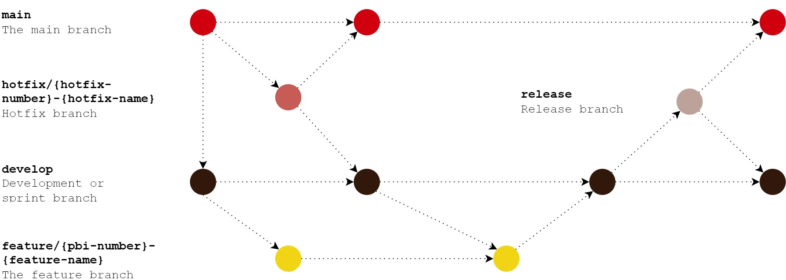

# Development Guidelines

## Git Flow

## Branch name

:white_check_mark: `feature/login-system`

**Lowercase and hyphen-separated** \
:x: `feature/login_system` \
:x: `feature/Login-System` \
:x: `feature/LOGIN-SYSTEM`

**Alphanumeric characters (a-z, 0–9)** \
:x: `feature/remove-@-from-mail`

**No Continuous hyphens** \
:x: `feature/login--system`

**No trailing hyphens** \
:x: `feature/loginsystem-`

**Descriptive** \
:x: `feature/lgn-sys` \
:x: `feature/01` \
:x: `feature/update` _What?_

**Default**

**main**: The main development branch \
**release**: The release branch release/v1.0.1

**Branch Prefixes**

**feature:** is for adding, refactoring or removing a feature \
**bugfix:** is for fixing a bug \
**hotfix:** is for changing code with a temporary solution and/or without following the usual process (usually because of an emergency) \
**chore**: For non-code tasks like dependency, docs updates (e.g., chore/update-dependencies)

 :white_check_mark: `main` \
 :white_check_mark: `release/v1.0.1`

 :white_check_mark: `feature/login-system` \
 :white_check_mark: `bugfix/header-styling` \
 :white_check_mark: `hotfix/critical-security-issue` \
 :white_check_mark: `chore/update-documentation`

### Semantic commit message

`<type>: <subject> #<pbi or hotfix>`

_\* PBI or hotfix not aplicable for this project_

**Types:**

**build:** Changes related to building the code (e.g. adding npm dependencies or external libraries) \
**chore:** Changes that do not affect the external user (e.g. updating the .gitignore file or .prettierrc file) \
**feat:** A new feature \
**fix:** A bug fix \
**chore:** Documentation a related changes \
**refactor:** A code that neither fix bug nor adds a feature. (eg: You can use this when there is semantic changes like renaming a variable/ function name) \
**perf:** A code that improves performance style: A code that is related to styling \
**test:** Adding new test or making changes to existing test

**Example:**

`feat: A new feature #1`
